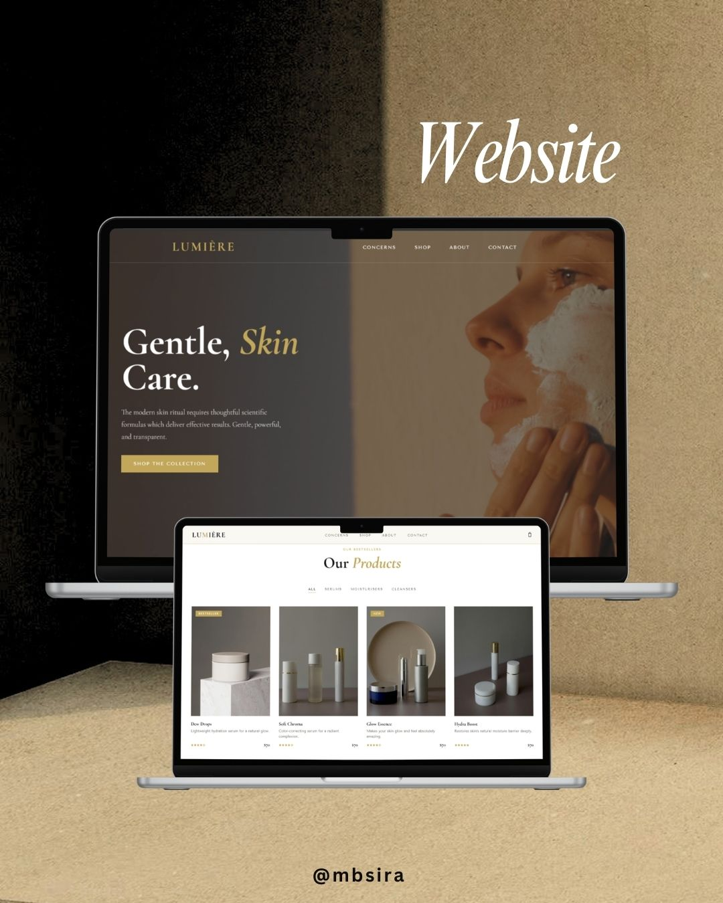

# LUMIÈRE | Skincare Website
This is a portfolio project — not a real brand or business.
🔗 **Live Demo:** [skincare-website-three.vercel.app](https://skincare-website-three.vercel.app)

A luxury skincare e-commerce landing page built using **HTML**, **CSS**, and **Vanilla JavaScript**. The design is inspired by high-end skincare brands like **Zenya**.

---

## Preview


---

## Design Philosophy

The design focuses on making a skincare brand feel premium without being cold:

- Mixing serif (`Cormorant Garamond`) and clean sans (`Tenor Sans`) fonts
- Warm gold accent color (`#C2A75A`) on a soft cream background
- Heavy editorial typography with italic accents
- Generous whitespace and minimal decoration

---

## Sections

### 1. Hero
Full-screen video background with dark overlay. Headline left-aligned with italic gold accent. Stats badge bottom-right.

### 2. Announcement Bar
Slim gold strip at the very top with promo code messaging.

### 3. Navbar
Fixed transparent nav with bottom border only. Logo in display serif, links in spaced uppercase. Live cart badge updates on add.

### 4. Marquee
Scrolling gold band — "Clean Formulas · Cruelty Free · Plant-Powered · Award-Winning".

### 5. Skin Concerns
Four image cards with gradient overlay and ingredient callouts at the bottom.

### 6. Products
4-column grid. Hover reveals "Add to Bag" button sliding up from below the image. Bestseller / New tags.

### 7. Promo Band
Full-width gold section with italic headline and discount code.

### 8. About
Two-column layout — video left, content right. 2×2 pillar grid for brand values.

### 9. Categories
Editorial list with circular thumbnails, category name, product count, and arrow.

### 10. Contact
Dark background section with borderless inputs and a gold send button.

### 11. Cart Sidebar
Slides in from the right with blurred overlay. Add, remove, adjust quantity. Toast notification on add. Order confirmation on checkout.

---

## Interactions

| Component | What happens |
|-----------|-------------|
| Navbar cart icon | Badge updates live |
| Product cards | "Add to Bag" slides up on hover |
| Add to Bag | Cart opens + toast notification fires |
| Cart qty buttons | Updates total in real time |
| Checkout button | Confirms order, clears cart, closes sidebar |
| Tab buttons | Active tab gets gold underline |
| Contact form | Button confirms submission |

---

## Tech Stack

- **HTML5**
- **CSS3** — custom properties, grid, flexbox
- **Vanilla JavaScript** — cart state, DOM rendering
- **Google Fonts** — Cormorant Garamond + Tenor Sans
- **Pexels** — royalty free video backgrounds

---

## Run Locally

Open with **Live Server** in VS Code, or:

```bash
python3 -m http.server 8080
```

Then visit `http://localhost:8080`

> ⚠️ Must use a local server — `script.js` won't load over `file://`

---

## Project Structure

```
Skincare-website/
├── index.html       — markup
├── style.css        — all styles + CSS variables
├── script.js        — cart logic, toast, contact form
├── skincare.png     — preview screenshot
└── README.md
```

---

## Known Issues

- Pexels video URLs may not autoplay in all browsers — replace with a direct `.mp4` if needed
- Cart resets on page refresh — no persistent storage
- Navbar is transparent — looks best over the video hero, may need a background on scroll for other sections

---

## Credits

- Design inspiration: [Zenya — Shopify Theme](https://themes.shopify.com)
- Videos: [Pexels](https://pexels.com)
- Fonts: [Google Fonts](https://fonts.google.com)

---

*Built by mbsira*
